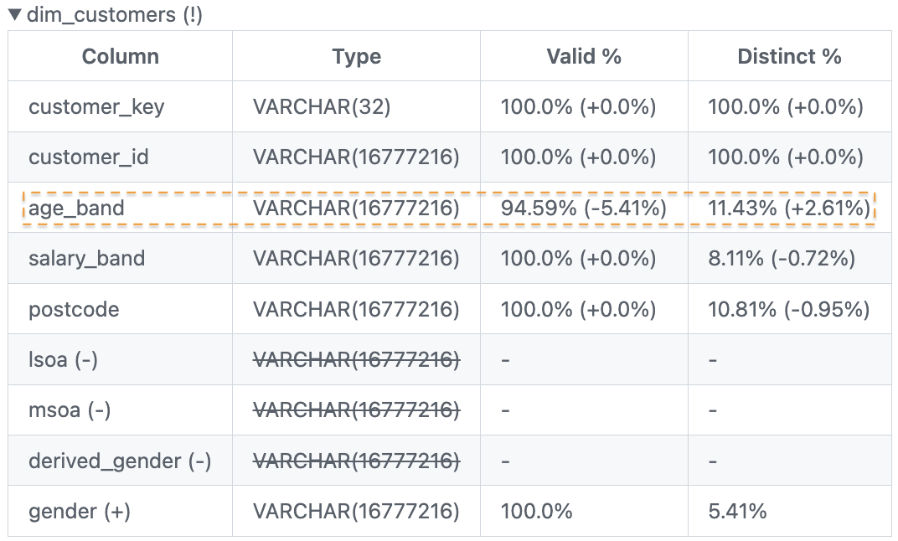

# Catch Your Data Quality Issues Early in The PR Review with PipeRider
This repo was created to accompany the article on <a href="https://github.com/DataTalksClub/data-engineering-zoomcamp/tree/main/week_2_data_ingestion" target="_blank">Catch Your Data Quality Issues Early in The PR Review with PipeRider</a>.

PipeRider allows you to understand how your existing data would change with the new incoming data and code changes in a comparison report. This comparison report can then be attached in the PR comment as part of the CI process.

PipeRider main use-case is as part of a dbt project. The value of PipeRider in your dbt project should be most evident when you integrate it in the CI pipeline. The process of profiling and testing your data models, detecting changes or differences in data models between different environments and posting the data profile comparison report in the PR comment can all be automated as part of your dbt project's CI process. 

With its comparison report, data and analytics engineers are able to:
- Merge confidently by catching the new data or code changes that lead to data quality issues before they enter production environment.
- Validate every source code change impact on the data to ensure the changes applied do not break any downstream data applications such as BI dashboard.

This certainly improve your productivity as a dbt developer.

# Common data quality issues 

# PipeRider in action

## 1. Adding, removing and changing column names.

## 2. Null values and other unexpected values.

## 3. Duplicate rows.

## 4. Adding or removing data models or tables.

## 5. Incorrect data types.

## 6. Incorrect metrics.

# To learn more about PipeRider:
- Follow this <a href="https://www.youtube.com/watch?v=O-tyUOQccSs&t=2711s">workshop on PipeRider + dbt</a>.
- <a href="https://docs.piperider.io/">PipeRider documentation</a>.
- <a href="https://blog.piperider.io/">PipeRider blog</a>.
- <a href="https://github.com/infuseai/piperider">PipeRider GitHub</a>.
